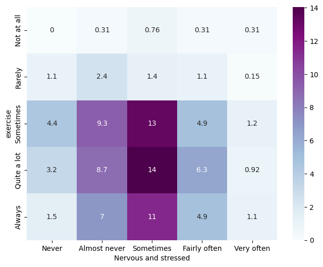

<div><br class="Apple-interchange-newline">
  
```python
import pandas as pd
import numpy as np
import matplotlib.pyplot as plt
import seaborn as sns
import statsmodels.api as sm
from statsmodels.formula.api import ols
from scipy import stats
from scipy.stats import chi2_contingency
%matplotlib inline
```

```python
df = pd.read_stata('data.dta') 
df.loc[(df['degree']==1) | (df['degree']==3) | (df['degree']==4),'background'] = 'Medical'
df.loc[(df['degree']==6),'background'] = 'Biochemistry'
```

```python
df_med = df[(df['degree']==1) | (df['degree']==3) | (df['degree']==4)]
df_bio = df[df['degree']==6]
```

# Abilities related to mental health of students

```python
def gen_grouped_bar(data, columns, title=' ', xlab=' ', legend=' ', legend_name=[]):
    value_counts = data[columns].apply(pd.value_counts)
    percentages = (value_counts / value_counts.sum()) * 100

    ax = percentages.plot(kind='bar', legend=True, figsize=(10, 5), width=.8)
    plt.ylabel('Percentage')
    plt.xlabel(xlab)
    plt.title(title)
    plt.xticks(rotation=0)
    plt.legend(title=legend, loc='upper center', labels=legend_name, bbox_to_anchor=(1.14, 1))
    plt.show()
```

```python
gen_grouped_bar(
    df_med, df.columns[2:14], 
    title='Different ability level of Medical students (percent)', 
    legend='Ability',
    legend_name = df.columns[2:14])
```


```python
gen_grouped_bar(
    df_bio, df.columns[2:14], 
    title='Different ability level of Biochemistry students (percent)', 
    legend='Ability',
    legend_name = df.columns[2:14])
```


# Activities of students in leisure time

```python
legend_names = ['Mediation', 'Nutrition', 'Exercise', 'Social Support', 
                'Spirituality', 'Mindfulness', 'Social Media']
gen_grouped_bar(
    df_med, df.columns[14:21], 
    title='Activities of Medical students (percent)', 
    legend='Activities',
    legend_name = legend_names)
```


```python
gen_grouped_bar(
    df_bio, df.columns[14:21], 
    title='Activities of Biochemistry students (percent)', 
    legend='Activities',
    legend_name = legend_names)
```


# Most effective stress relieving activities according to students

```python
c_names = ['Mediation', 'Nutrition', 'Exercise', 'Social Support', 
           'Spirituality', 'Mindfulness', 'Social Media']
df_mr = df_med[df.columns[22:29]]
df_dummies = pd.get_dummies(df_mr, columns=df.columns[22:29])
df_dummies.columns = c_names
response_counts = df_dummies.sum()
percentage = response_counts/np.shape(df_med)[0] * 100
percentage.round(3)
```

    Mediation          3.026
    Nutrition          0.908
    Exercise          35.703
    Social Support    26.172
    Spirituality       6.203
    Mindfulness        2.874
    Social Media       2.874
    dtype: float64

```python
percentage.plot(kind='bar', figsize=(10, 4), width=.7)
plt.xticks(rotation=0)
plt.xlabel('Activities')
plt.ylabel('Number of cases')
plt.title('Most effective at relieving stress according to Medical students (Percent of cases)')
plt.show()
```


Most of the Medical students thinks that 'Exercise' (35.70%) and 'Social Support Activities' (26.17%) are effective on stress relieve.

```python
df_mr = df_bio[df.columns[22:29]]
df_dummies = pd.get_dummies(df_mr, columns=df.columns[22:29])
df_dummies.columns = c_names
response_counts = df_dummies.sum()
percentage = response_counts/np.shape(df_bio)[0] * 100
percentage.round(3)
```

    Mediation          0.787
    Nutrition          3.150
    Exercise          33.465
    Social Support    13.780
    Spirituality       4.331
    Mindfulness        0.787
    Social Media       3.543
    dtype: float64

```python
percentage.plot(kind='bar', figsize=(10, 4), width=.7)
plt.xticks(rotation=0)
plt.xlabel('Activities')
plt.ylabel('Number of cases')
plt.title('Most effective at relieving stress according to Biochemistry students (Percent of cases)')
plt.show()
```


Most of the Medical students thinks that 'Exercise' (33.46%) and 'Social Support Activities' (13.78%) are effective on stress relieve.

### Comparison: (Social Media)

Only 2.87% of Medical students and 3.54% Biochemistry students thinks that 'Social Media' effective on stress relieve. This number is quite small than 'Exercise' and 'Social Support Activities' in both of the groups.

# Analysing students stress score

## By degree

```python
df['stressScore'].describe().round(2)
```

    count    876.00
    mean      25.96
    std        4.34
    min       12.00
    25%       23.00
    50%       26.00
    75%       29.00
    max       37.00
    Name: stressScore, dtype: float64

```python
plt.figure(figsize=(7, 5))
sns.boxplot(data=df, x='background', y='stressScore')
plt.xlabel('Background')
plt.ylabel('Stress Score')
plt.title('Stress Score of Medical and Biochemistry students')
plt.show()

```


We suspect a difference of score in the graph between tow cohort. We will do a two independent samples t-test to clarify the doubt.

## Hypothesis testing of mean difference of score between Medical and Biochemistry students

$H_0: \mu_{Med} = \mu_{Bio} \\$
$H_1: \mu_{Med} \neq \mu_{Bio}$

```python
med_score = df.loc[df["background"]=="Medical", 'stressScore']
med_score = med_score[~np.isnan(med_score)]
med_score.describe().round(2)
```

    count    647.00
    mean      26.44
    std        4.14
    min       13.00
    25%       24.00
    50%       27.00
    75%       29.00
    max       37.00
    Name: stressScore, dtype: float64

```python
bio_score = df.loc[df["background"]=="Biochemistry", 'stressScore']
bio_score = bio_score[~np.isnan(bio_score)]
bio_score.describe().round(2)
```

    count    229.00
    mean      24.62
    std        4.60
    min       12.00
    25%       22.00
    50%       25.00
    75%       28.00
    max       37.00
    Name: stressScore, dtype: float64

```python
t_statistic, p_value = stats.ttest_ind(med_score, bio_score)

print("t-Statistic:", t_statistic.round(3))
print("P-Value:", p_value.round(11))

alpha = 0.05
if p_value < alpha:
    print("Reject the null hypothesis: There is a significant difference between the samples.")
else:
    print("Fail to reject the null hypothesis: There is no significant difference between the samples.")

```

    t-Statistic: 5.565
    P-Value: 3.496e-08
    Reject the null hypothesis: There is a significant difference between the samples.

So, it is now clear that Medical students have significantly higher score and Biochemistry students have less.

## By year

```python
plt.figure(figsize=(8, 5))
sns.boxplot(data=df, x='year', y='stressScore')
plt.xlabel('Year')
plt.ylabel('Stress Score')
plt.title('Stress Score of Medical and Biochemistry students')
plt.show()

```


Mean stress score of different year student may equal. We can predict this by the graph shown above. Let's check if the prediction is right.

## Are mean stress scores of different year student same?

$H_0: \mu_{1} = \mu_{2} = \mu_{3} \\$
$H_1: \mu_i \neq \mu_j$ ; at least for one $ i \neq j$

```python
formula = 'stressScore ~ year'
model = ols(formula, data=df).fit()
anova_table = sm.stats.anova_lm(model, typ=2)
anova_table
```

<div>
<style scoped>
    .dataframe tbody tr th:only-of-type {
        vertical-align: middle;
    }

    .dataframe tbody tr th {
        vertical-align: top;
    }

    .dataframe thead th {
        text-align: right;
    }`</style>`

<table border="1" class="dataframe">
  <thead>
    <tr style="text-align: right;">
      <th></th>
      <th>sum_sq</th>
      <th>df</th>
      <th>F</th>
      <th>PR(>F)</th>
    </tr>
  </thead>
  <tbody>
    <tr>
      <th>year</th>
      <td>18.665372</td>
      <td>2.0</td>
      <td>0.494706</td>
      <td>0.609921</td>
    </tr>
    <tr>
      <th>Residual</th>
      <td>16469.237596</td>
      <td>873.0</td>
      <td>NaN</td>
      <td>NaN</td>
    </tr>
  </tbody>
</table>
</div>

    coef  	 std err 	 t	     P>|t|   [0.025	  0.975]
Intercept	  25.8731	  0.217	  119.435	 0.000	 25.448  26.298
Second year    0.3374	  0.360	    0.937	 0.349	 -0.369	  1.044
Third year	   0.0130	  0.352	    0.037	 0.970	 -0.677	  0.703
Here, p-value>.05. So we may not reject the$H_0$. So, means of score are equal in each year of students.

## Relation between stress score and social media usage

```python
plt.figure(figsize=(8, 5))
sns.boxplot(data=df, x='socialMedia', y='stressScore')
plt.xlabel('Social Media')
plt.ylabel('Stress Score')
plt.title('Stress Score in different level of social media usage')
plt.show()
```


$H_0: \mu_1 = \mu_2 = \mu_3 = \mu_4 = \mu_5  \\$
$H_1: \mu_i \neq \mu_j$ ; at least for one $ i \neq j$

```python
formula = 'stressScore ~ socialMedia'
model = ols(formula, data=df).fit()
anova_table = sm.stats.anova_lm(model, typ=2)
anova_table
```

<div>
<style scoped>
    .dataframe tbody tr th:only-of-type {
        vertical-align: middle;
    }

    .dataframe tbody tr th {
        vertical-align: top;
    }

    .dataframe thead th {
        text-align: right;
    }`</style>`

<table border="1" class="dataframe">
  <thead>
    <tr style="text-align: right;">
      <th></th>
      <th>sum_sq</th>
      <th>df</th>
      <th>F</th>
      <th>PR(>F)</th>
    </tr>
  </thead>
  <tbody>
    <tr>
      <th>socialMedia</th>
      <td>70.073632</td>
      <td>4.0</td>
      <td>0.929572</td>
      <td>0.446003</td>
    </tr>
    <tr>
      <th>Residual</th>
      <td>16376.896620</td>
      <td>869.0</td>
      <td>NaN</td>
      <td>NaN</td>
    </tr>
  </tbody>
</table>
</div>

    coef  	 std err 	t	     P>|t|   [0.025	  0.975]
Intercept	   25.7000	 1.373	  18.721	 0.000   23.006	  28.394
Rarely         0.3889    1.518	   0.256     0.798   -2.590	   3.368
Sometimes	   0.1963	 1.414	   0.139	 0.890   -2.579	   2.972
Quite a lot    0.5430	 1.390	   0.391     0.696   -2.186	   3.272
Always	      -0.1129	 1.399	  -0.081	 0.936   -2.858	   2.632
Here, p-value>.05. So we may not reject the$H_0$. So, means of score are equal in each level of social media usage. So, it is unnessecary to check individual groups. (eg: Medical, Biochemistry)

# Last month mental condition

```python
legend_names = ['Something happened unexpectedly', 'Practice Mindfulness',
       'Doing things without paying attention', 'Nervous and stressed',
       'Confident about ability to handle stress', 'Preoccupied with events',
       'Angered because of things outside', 'Dificulties were piling up so high']

gen_grouped_bar(
    df_med, df.columns[97:105], 
    title='Mental condition of Medical students (percent)', 
    legend='Variables',
    legend_name = legend_names)
```


```python
legend_names = ['Something happened unexpectedly', 'Practice Mindfulness',
       'Doing things without paying attention', 'Nervous and stressed',
       'Confident about ability to handle stress', 'Preoccupied with events',
       'Angered because of things outside', 'Dificulties were piling up so high']

gen_grouped_bar(
    df_bio, df.columns[97:105], 
    title='Mental condition of Biochemistry students (percent)', 
    legend='Variables',
    legend_name = legend_names)
```


# Relationship between Social Media and Stress of Medical students

```python
columns_to_analyze = [
    'something_happened_unexpectedly', 'practice_Mindfulness',
    'doing_things_without_paying_atte', 'nervous_and_stressed',
    'confident_about_ability_to_handl', 'preoccupied_with_events',
    'angered_because_of_things_outsid', 'dificulties_were_piling_up_so_hi'
]
c_names = ['Something happened unexpectedly', 'Practice Mindfulness',
       'Doing things without paying attention', 'Nervous and stressed',
       'Confident about ability to handle stress', 'Preoccupied with events',
       'Angered because of things outside', 'Dificulties were piling up so high']
stat = {'ChiSQ': [], "p-value": []}

for column in columns_to_analyze:
    contingency_table = pd.crosstab(df_med['socialMedia'], df_med[column])
  
    chi2, p, _, _ = chi2_contingency(contingency_table)

    stat['ChiSQ'].append(chi2)
    stat['p-value'].append(p)
  

stat = pd.DataFrame(stat, index=c_names)
stat['alpha=5%'] = stat['p-value']<0.05
stat['alpha=10%'] = stat['p-value']<0.1

stat
```

<div>
<style scoped>
    .dataframe tbody tr th:only-of-type {
        vertical-align: middle;
    }

    .dataframe tbody tr th {
        vertical-align: top;
    }

    .dataframe thead th {
        text-align: right;
    }`</style>`

<table border="1" class="dataframe">
  <thead>
    <tr style="text-align: right;">
      <th></th>
      <th>ChiSQ</th>
      <th>p-value</th>
      <th>alpha=5%</th>
      <th>alpha=10%</th>
    </tr>
  </thead>
  <tbody>
    <tr>
      <th>Something happened unexpectedly</th>
      <td>20.083040</td>
      <td>0.216504</td>
      <td>False</td>
      <td>False</td>
    </tr>
    <tr>
      <th>Practice Mindfulness</th>
      <td>14.099832</td>
      <td>0.591277</td>
      <td>False</td>
      <td>False</td>
    </tr>
    <tr>
      <th>Doing things without paying attention</th>
      <td>32.249270</td>
      <td>0.009278</td>
      <td>True</td>
      <td>True</td>
    </tr>
    <tr>
      <th>Nervous and stressed</th>
      <td>42.368355</td>
      <td>0.000348</td>
      <td>True</td>
      <td>True</td>
    </tr>
    <tr>
      <th>Confident about ability to handle stress</th>
      <td>25.103563</td>
      <td>0.068020</td>
      <td>False</td>
      <td>True</td>
    </tr>
    <tr>
      <th>Preoccupied with events</th>
      <td>25.118775</td>
      <td>0.067759</td>
      <td>False</td>
      <td>True</td>
    </tr>
    <tr>
      <th>Angered because of things outside</th>
      <td>25.453792</td>
      <td>0.062215</td>
      <td>False</td>
      <td>True</td>
    </tr>
    <tr>
      <th>Dificulties were piling up so high</th>
      <td>19.495242</td>
      <td>0.243819</td>
      <td>False</td>
      <td>False</td>
    </tr>
  </tbody>
</table>
</div>

True = Associated with social media
False = Not associated with social media

```python
stat['p-value'].plot(kind='bar')
plt.axhline(y=.05, color='r', label='Horizontal Line at y=15')
plt.axhline(y=.1, color='g', label='Horizontal Line at y=15')
plt.xticks(rotation=85)
plt.show()

```


## Heatmap plot for significant pairs (Percent of cases)

From the plot above we can see 'Social Media' usage of Medical students is associated with 'Doing things without paying attention' and 'Nervous and stressed'. Let's visualise the association with the help of heatmap plot.

```python
def gen_heatmap(data, factor1, factor2):
    columns_to_analyze = [
        'something_happened_unexpectedly', 'practice_Mindfulness',
        'doing_things_without_paying_atte', 'nervous_and_stressed',
        'confident_about_ability_to_handl', 'preoccupied_with_events',
        'angered_because_of_things_outsid', 'dificulties_were_piling_up_so_hi']
    c_names = [
        'Something happened unexpectedly', 'Practice Mindfulness',
        'Doing things without paying attention', 'Nervous and stressed',
        'Confident about ability to handle stress', 'Preoccupied with events',
        'Angered because of things outside', 'Dificulties were piling up so high']
    pivot_table = pd.crosstab(data[factor1], data[factor2])
    total_count = pivot_table.values.sum()
    overall_percentage = (pivot_table / total_count * 100).round(2)
    plt.figure(figsize=(8, 6))
    sns.heatmap(overall_percentage, annot=True, cmap='BuPu')
    plt.xlabel(c_names[columns_to_analyze.index(factor2)])
    plt.ylabel(factor1)
    plt.show()
```

```python
gen_heatmap(df_med, 'socialMedia', 'doing_things_without_paying_atte')
```


```python
gen_heatmap(df_med, 'socialMedia', 'nervous_and_stressed')
```


# Relationship between Social Media and Stress of Biochemistry students

```python
stat = {'ChiSQ': [], "p-value": []}

for column in columns_to_analyze:
    contingency_table = pd.crosstab(df_bio['socialMedia'], df_bio[column])
  
    chi2, p, _, _ = chi2_contingency(contingency_table)

    stat['ChiSQ'].append(chi2)
    stat['p-value'].append(p)
  

stat = pd.DataFrame(stat, index=c_names)
stat['alpha=5%'] = stat['p-value']<0.05
stat['alpha=10%'] = stat['p-value']<0.1

stat
```

<div>
<style scoped>
    .dataframe tbody tr th:only-of-type {
        vertical-align: middle;
    }

    .dataframe tbody tr th {
        vertical-align: top;
    }

    .dataframe thead th {
        text-align: right;
    }`</style>`

<table border="1" class="dataframe">
  <thead>
    <tr style="text-align: right;">
      <th></th>
      <th>ChiSQ</th>
      <th>p-value</th>
      <th>alpha=5%</th>
      <th>alpha=10%</th>
    </tr>
  </thead>
  <tbody>
    <tr>
      <th>Something happened unexpectedly</th>
      <td>15.203546</td>
      <td>0.509784</td>
      <td>False</td>
      <td>False</td>
    </tr>
    <tr>
      <th>Practice Mindfulness</th>
      <td>13.593694</td>
      <td>0.628954</td>
      <td>False</td>
      <td>False</td>
    </tr>
    <tr>
      <th>Doing things without paying attention</th>
      <td>14.727804</td>
      <td>0.544658</td>
      <td>False</td>
      <td>False</td>
    </tr>
    <tr>
      <th>Nervous and stressed</th>
      <td>15.874324</td>
      <td>0.461766</td>
      <td>False</td>
      <td>False</td>
    </tr>
    <tr>
      <th>Confident about ability to handle stress</th>
      <td>32.783452</td>
      <td>0.007894</td>
      <td>True</td>
      <td>True</td>
    </tr>
    <tr>
      <th>Preoccupied with events</th>
      <td>15.138349</td>
      <td>0.514530</td>
      <td>False</td>
      <td>False</td>
    </tr>
    <tr>
      <th>Angered because of things outside</th>
      <td>24.910255</td>
      <td>0.071423</td>
      <td>False</td>
      <td>True</td>
    </tr>
    <tr>
      <th>Dificulties were piling up so high</th>
      <td>13.243192</td>
      <td>0.654900</td>
      <td>False</td>
      <td>False</td>
    </tr>
  </tbody>
</table>
</div>

True = Associated with social media
False = Not associated with social media

```python
stat['p-value'].plot(kind='bar')
plt.axhline(y=.05, color='r', label='Horizontal Line at y=15')
plt.axhline(y=.1, color='g', label='Horizontal Line at y=15')
plt.xticks(rotation=85)
plt.show()

```


## Heatmap plot for significant pairs

From the plot above we can see 'Social Media' usage by Biochemistry students is associated with 'Doing things without paying attention' and 'Nervous and stressed'. Let's visualise the association with the help of a heatmap plot.

```python
gen_heatmap(df_bio, 'socialMedia', 'confident_about_ability_to_handl')
```


# Cause of stress

```python
c_names = ['Finance', 'Course workload', 'Personal Relationships', 'Moving to university', 'Social/Recreational', 'Health']

df_mr = df_med[df.columns[107:113]]
df_dummies = pd.get_dummies(df_mr, columns=df.columns[107:113])
df_dummies.columns = c_names
response_counts = df_dummies.sum()
percentage = response_counts/np.shape(df_med)[0] * 100
percentage.round(3)
```

    Finance                   13.767
    Course workload           51.740
    Personal Relationships    37.519
    Moving to university      25.567
    Social/Recreational        6.808
    Health                     5.144
    dtype: float64

```python
percentage.plot(kind='bar', figsize=(10, 4), width=.7)
plt.xticks(rotation=0)
plt.xlabel('Causes')
plt.ylabel('Number of cases')
plt.xticks(rotation=85)
plt.title('Cause of stress of Medical students')
plt.show()
```


```python
c_names = ['Finance', 'Course workload', 'Personal Relationships', 'Moving to university', 'Social/Recreational', 'Health']

df_mr = df_bio[df.columns[107:113]]
df_dummies = pd.get_dummies(df_mr, columns=df.columns[107:113])
df_dummies.columns = c_names
response_counts = df_dummies.sum()
percentage = response_counts/np.shape(df_bio)[0] * 100
percentage.round(3)
```

    Finance                   20.079
    Course workload           40.945
    Personal Relationships    33.071
    Moving to university       5.512
    Social/Recreational        4.724
    Health                     7.087
    dtype: float64

```python
percentage.plot(kind='bar', figsize=(10, 4), width=.7)
plt.xticks(rotation=0)
plt.xlabel('Causes')
plt.ylabel('Number of cases')
plt.xticks(rotation=85)
plt.title('Cause of stress of Biochemistry students')
plt.show()
```


In conclusion we can say. Social media may not be a cause to reduce stress. Also Exercise can be a good factor of reducing stress.

# Relationship between Exercise and Stress of Medical students

```python
columns_to_analyze = [
    'something_happened_unexpectedly', 'practice_Mindfulness',
    'doing_things_without_paying_atte', 'nervous_and_stressed',
    'confident_about_ability_to_handl', 'preoccupied_with_events',
    'angered_because_of_things_outsid', 'dificulties_were_piling_up_so_hi'
]
c_names = ['Something happened unexpectedly', 'Practice Mindfulness',
       'Doing things without paying attention', 'Nervous and stressed',
       'Confident about ability to handle stress', 'Preoccupied with events',
       'Angered because of things outside', 'Dificulties were piling up so high']
stat = {'ChiSQ': [], "p-value": []}

for column in columns_to_analyze:
    contingency_table = pd.crosstab(df_med['exercise'], df_med[column])
  
    chi2, p, _, _ = chi2_contingency(contingency_table)

    stat['ChiSQ'].append(chi2)
    stat['p-value'].append(p)
  

stat = pd.DataFrame(stat, index=c_names)
stat['alpha=5%'] = stat['p-value']<0.05
stat['alpha=10%'] = stat['p-value']<0.1

stat
```

<div>
<style scoped>
    .dataframe tbody tr th:only-of-type {
        vertical-align: middle;
    }

    .dataframe tbody tr th {
        vertical-align: top;
    }

    .dataframe thead th {
        text-align: right;
    }`</style>`

<table border="1" class="dataframe">
  <thead>
    <tr style="text-align: right;">
      <th></th>
      <th>ChiSQ</th>
      <th>p-value</th>
      <th>alpha=5%</th>
      <th>alpha=10%</th>
    </tr>
  </thead>
  <tbody>
    <tr>
      <th>Something happened unexpectedly</th>
      <td>25.229857</td>
      <td>0.065874</td>
      <td>False</td>
      <td>True</td>
    </tr>
    <tr>
      <th>Practice Mindfulness</th>
      <td>23.191835</td>
      <td>0.108702</td>
      <td>False</td>
      <td>False</td>
    </tr>
    <tr>
      <th>Doing things without paying attention</th>
      <td>9.877051</td>
      <td>0.872970</td>
      <td>False</td>
      <td>False</td>
    </tr>
    <tr>
      <th>Nervous and stressed</th>
      <td>23.572497</td>
      <td>0.099266</td>
      <td>False</td>
      <td>True</td>
    </tr>
    <tr>
      <th>Confident about ability to handle stress</th>
      <td>27.135178</td>
      <td>0.040005</td>
      <td>True</td>
      <td>True</td>
    </tr>
    <tr>
      <th>Preoccupied with events</th>
      <td>14.923523</td>
      <td>0.530247</td>
      <td>False</td>
      <td>False</td>
    </tr>
    <tr>
      <th>Angered because of things outside</th>
      <td>23.347316</td>
      <td>0.104761</td>
      <td>False</td>
      <td>False</td>
    </tr>
    <tr>
      <th>Dificulties were piling up so high</th>
      <td>25.538748</td>
      <td>0.060874</td>
      <td>False</td>
      <td>True</td>
    </tr>
  </tbody>
</table>
</div>

True = Associated with social media
False = Not associated with social media

```python
stat['p-value'].plot(kind='bar')
plt.axhline(y=.05, color='r', label='Horizontal Line at y=15')
plt.axhline(y=.1, color='g', label='Horizontal Line at y=15')
plt.xticks(rotation=85)
plt.show()

```


For 10% tollarence 'Exercise' is associated with 'Something happened unexpectedly', 'Nervous and stressed', 'Confident about ability to handle stress' and 'Dificulties were piling up so high' Let's have a look on heatmap.

```python
gen_heatmap(df_med, 'exercise', 'something_happened_unexpectedly')
```


```python
gen_heatmap(df_med, 'exercise', 'nervous_and_stressed')
```



```python
gen_heatmap(df_med, 'exercise', 'confident_about_ability_to_handl')
```


```python
gen_heatmap(df_med, 'exercise', 'dificulties_were_piling_up_so_hi')
```


# Relationship between Exercise and Stress of Biochemistry students

```python
stat = {'ChiSQ': [], "p-value": []}

for column in columns_to_analyze:
    contingency_table = pd.crosstab(df_bio['exercise'], df_bio[column])
  
    chi2, p, _, _ = chi2_contingency(contingency_table)

    stat['ChiSQ'].append(chi2)
    stat['p-value'].append(p)
  

stat = pd.DataFrame(stat, index=c_names)
stat['alpha=5%'] = stat['p-value']<0.05
stat['alpha=10%'] = stat['p-value']<0.1

stat
```

<div>
<style scoped>
    .dataframe tbody tr th:only-of-type {
        vertical-align: middle;
    }

    .dataframe tbody tr th {
        vertical-align: top;
    }

    .dataframe thead th {
        text-align: right;
    }`</style>`

<table border="1" class="dataframe">
  <thead>
    <tr style="text-align: right;">
      <th></th>
      <th>ChiSQ</th>
      <th>p-value</th>
      <th>alpha=5%</th>
      <th>alpha=10%</th>
    </tr>
  </thead>
  <tbody>
    <tr>
      <th>Something happened unexpectedly</th>
      <td>30.113206</td>
      <td>0.017424</td>
      <td>True</td>
      <td>True</td>
    </tr>
    <tr>
      <th>Practice Mindfulness</th>
      <td>20.348091</td>
      <td>0.204950</td>
      <td>False</td>
      <td>False</td>
    </tr>
    <tr>
      <th>Doing things without paying attention</th>
      <td>9.614803</td>
      <td>0.885955</td>
      <td>False</td>
      <td>False</td>
    </tr>
    <tr>
      <th>Nervous and stressed</th>
      <td>19.575826</td>
      <td>0.239936</td>
      <td>False</td>
      <td>False</td>
    </tr>
    <tr>
      <th>Confident about ability to handle stress</th>
      <td>32.058208</td>
      <td>0.009827</td>
      <td>True</td>
      <td>True</td>
    </tr>
    <tr>
      <th>Preoccupied with events</th>
      <td>14.690695</td>
      <td>0.547398</td>
      <td>False</td>
      <td>False</td>
    </tr>
    <tr>
      <th>Angered because of things outside</th>
      <td>14.878598</td>
      <td>0.533548</td>
      <td>False</td>
      <td>False</td>
    </tr>
    <tr>
      <th>Dificulties were piling up so high</th>
      <td>29.393143</td>
      <td>0.021416</td>
      <td>True</td>
      <td>True</td>
    </tr>
  </tbody>
</table>
</div>

True = Associated with social media
False = Not associated with social media

```python
stat['p-value'].plot(kind='bar')
plt.axhline(y=.05, color='r', label='Horizontal Line at y=15')
plt.axhline(y=.1, color='g', label='Horizontal Line at y=15')
plt.xticks(rotation=85)
plt.show()

```


For 5% tolerance  'Exercise' is associated with 'Something happened unexpectedly', 'Confident about ability to handle stress' and ''Difficulties  were piling up so high' Let's have a look on heatmap.

```python
gen_heatmap(df_bio, 'exercise', 'something_happened_unexpectedly')
```


```python
gen_heatmap(df_bio, 'exercise', 'confident_about_ability_to_handl')
```


```python
gen_heatmap(df_bio, 'exercise', 'dificulties_were_piling_up_so_hi')
```


